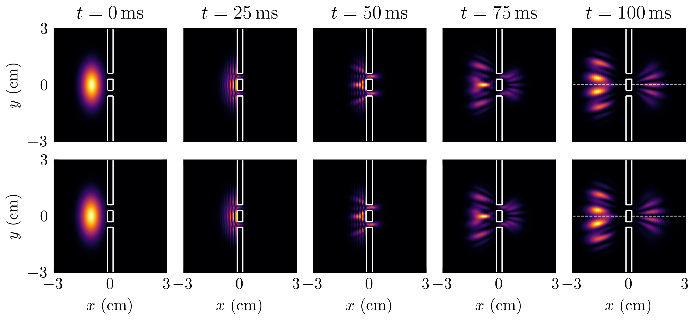
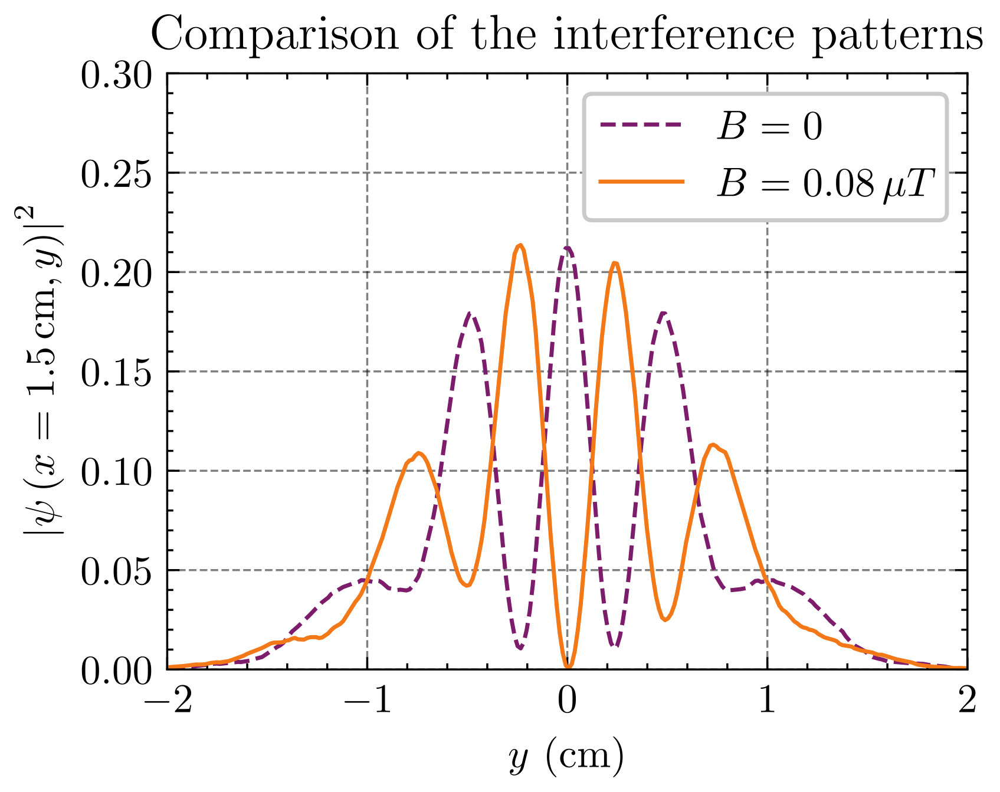

# AB-simulation
This repository contains the material related to a simulation of the Aharonov-Bohm effect prepared to complete an essay about this topic. It is part of the "Advanced Quantum Mechanics" course in the Master's in Quantum Science and Technology. The main script has been taken from Ref. [1], and addapted to complete our goals. The main challenge has been to modify the simulation is such a way to sample intermediate states, in order to visualize the whole process

We simulate the evolution of a Gaussian wave packet centered at $(x_0,y_0)=(-1,0)$ cm, with variance $\Delta x=0.5$ cm and $\Delta y =1$ cm and initial momentum given by $k_{x0}=20\,\text{cm}^{-1}$ for $t=100$ ms. Each slit is $0.3$ cm wide and they are $0.6$ cm apart. The wall is $0.3$ cm thick. The radius of the solenoid is $R=0.01$ cm. A $400\times 400$ spatial grid has been used, and $10^6$ time-steps in total. Check the `.mp4` files which are the animations made with the results of the simulations. 

    
     
    <em><strong>Figure 1</strong>: Evolution of the probability density electron wave packet. The first row shows five frames obtained for a null magnetic field. The images from the second row have been obtained with B=0.08 mu T. The lightest colors represent the zone where the probability density is highest. The exact values and the color bar have been voluntarily omitted, since the important conclusion is a qualitative change in the frames obtained at t=100 ms: the lobe in the horizontal dashed line, corresponding to a maximum, disappears when the magnetic field is turned on. See Fig. 2 for more details.</em>

    
     
    <em><strong>Figure 2</strong>: Comparison of the interference patterns obtained at a screen located at x=1.5 cm after the slits, when t=100 ms. As a consequence of turning on the magnetic field, the interference pattern undergoes a phase shift. The value of the magnetic field has been chosen to maximize this effect.</em>

## References
[1] Andrea Gobbo. Numerical Study of Aharonov-Bohm effect. GitHub repository, Jun 2024. URL [https://github.com/a-gobbo/Aharonov-Bohm]. (Visited on 7/10/2024).

[2] Benjamin Colmey. Aharonov-Bohm space charge effects in python. GitHub repository, Nov 2023. URL [https://github.com/bcolmey/Aharonov-Bohm-Space-Charge-Effects-in-Python]. (Visited on 1/10/2024).

[3] Arturo Mena López. Double slit 2D Schrödinger. GitHub repository, Aug 2022. URL [https://github.com/artmenlope/double-slit-2d-schrodinger]. (Visited on 3/10/2024).

[4] Félix Desrochers. Electron diffraction. GitHub repository, Jul 2019. URL [https://github.com/FelixDesrochers/Electron-diffraction]. (Visited on 3/10/2024).
